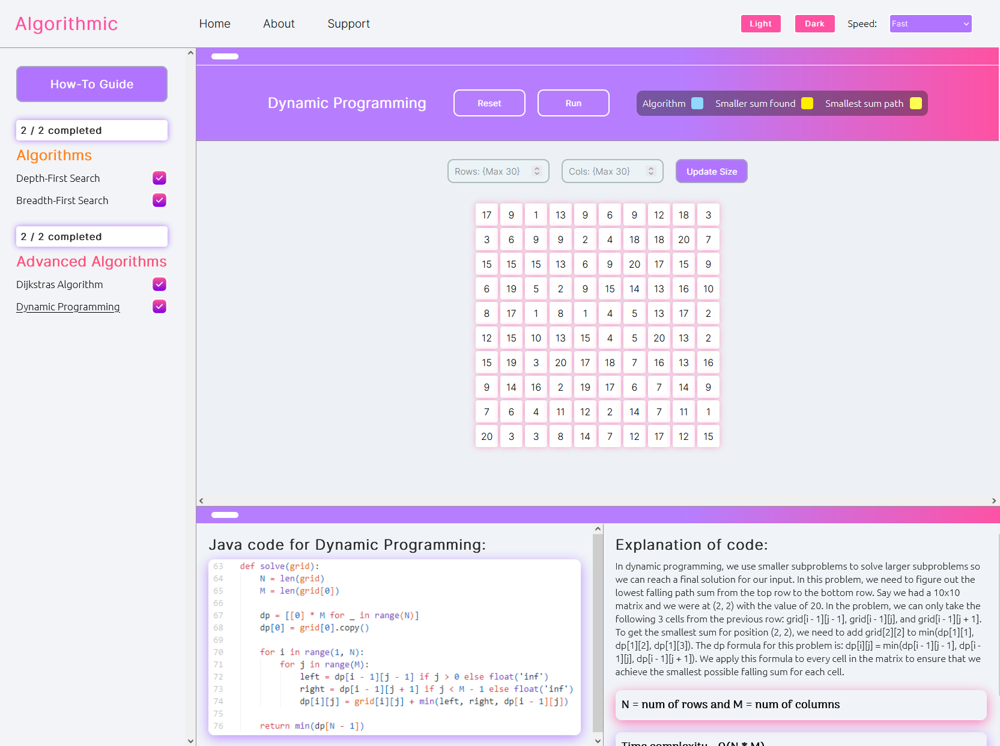

# Algorithm Visualizer

#### A tool to visualize different algorithms to help users get an understanding of how they work. Users can customize the behaviour of the algorithms by adding obstacles to the grid and changing the start and end points.

Technologies used:
- React.js

I built this project to make it easier to understand and analyze the behavior of different algorithms to help users solidify their understanding of them.
My goal was to make more difficult algorithm topics such as Dynamic Programming and Dijkstras Algorithm, easier to dijest for students that are interested in these algorithms, preparing for their coding interviews, or both!

## Supported algorithms

Here is a list of algorithms that can be visualized:

- Depth-First Search
- Breadhth-First Search
- Dijkstras Algorithm
- Dynamic Programming

## Setting up the project locally

To install this project locally on your machine is pretty quick and straightforward:

1. clone this project
2. run 'npm install' in the root directory to install necessary dependencies.

## Running the project locally

1. run 'npm start' to spin up the development server.

## Find a bug?

If you found an issue or would like to contribute to this project, please raise an issue first before making a pull request. When you submit a PR, reference the issue you created so I know what you fixed.